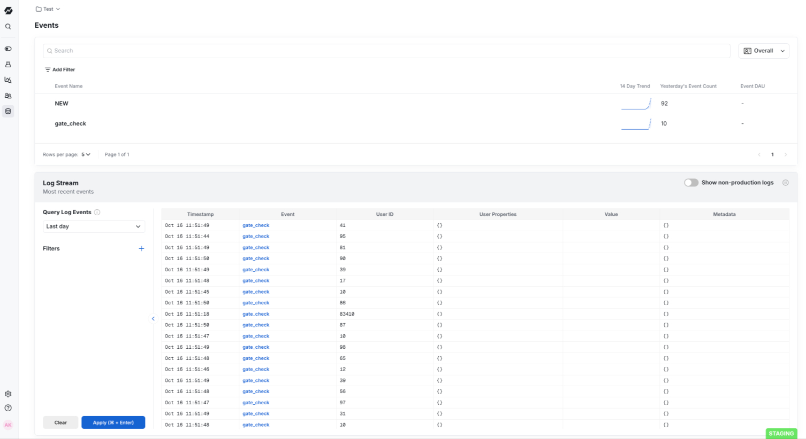

## Overview
Statsig’s Cloudflare integration pushes Statsig Configs to Cloudflare KV, providing low latency for gate and experiment evaluations in Cloudflare Workers.

## Configure Integration
First, enable the Cloudflare integration in the Statsig Console.

Navigate to [Project Settings -> Integrations](https://console.statsig.com/integrations), and then select Cloudflare

You will need to input the following:
- **Cloudflare Account ID**: Can be found in Cloudflare portal on the **Compute (Workers)** page, under **Account Details**
- **KV Namespace ID**: We recommend creating a new KV namespace for your Statsig integration. You can create a new namespace, and get the ID from **Account Home** -> **Storage and Databases** -> **Workers KV**, and copy it from the table view.
- **Cloudflare API Key**: Can be found in Cloudflare portal under **Account Home** -> **Profile** -> **API Tokens**. You need a token with Account.Workers KV Storage Edit Permissions.

There is also an option to filter the configs that are synced into your KV namespace by a [/sdk-keys/target-apps](Target App).  You may wish to enable this in the future as the size of your config payload grows.  For now, you can leave this unchecked.

After filling this out, click **Enable**.

Within a minute, the Statsig backend should generate a config payload from your Statsig project and push it into your KV namespace.  Under your KV namespace, navigate to **KV Pairs** - you should see an entry starting with the prefix `statsig-`. This is they `key` associated with your KV storage. You may change this key name. For ease of use, the default key we recommend is `STATSIG_SPECS`.

## Add the Statsig SDK to your Worker
Now lets hook up the SDK to read that config payload and use it for gate and experiment checks in your worker.  If you've never created a worker before, you can follow the instructions [here](https://developers.cloudflare.com/workers/).

After creating your worker, you will need to connect your KV store to your worker through a binding. Navigate to **Compute (Workers)** -> **Select Your Worker** -> **Bindings** -> **Add binding** -> **KV namespace**. Name your binding under **Variable name**. The default we recommend is `STATSIG_KV`. Under **KV namespace**, select your KV store name. For more information on connecting your worker to your KV store, you can follow the instructions [here](https://developers.cloudflare.com/pages/functions/bindings/).

The remainder of this document assumes you are using **Node.js**.

<Note>
The`@statsig/serverless-client/cloudflare` package only supports JavaScript. 
</Note>

First, you'll need to install the Statsig serverless sdk.

```bash
npm install @statsig/serverless-client
```

Next, import the Cloudflare client.

```bash
import { StatsigCloudflareClient } from '@statsig/serverless-client/cloudflare';
```

Then, you need to hook it all up.  This involves:

1. Creating a `StatsigCloudflareClient` instance.
2. Initializing the Statsig client
3. Checking a Gate
4. Logging an event
5. Flushing events to Statsig

If you've used a Statsig sdk in the past, these steps should be familiar. The usage will be the same, the only difference is the sdk will initialize from the KV store instead of the statsig backend.

In our example, we are checking a gate called "test_cloudflare_sync" that is set to a 50% pass rate.  We create a random userID on every request, and we should see it evaluate to true 50% of the time.

### 1. Creating a `StatsigCloudflareClient` instance
```
const client = new StatsigCloudflareClient("<Your Statsig client key>", {loggingEnabled: 'always'});
```
The client instantiation takes two arguments:
- `client key : string`  This is available from the [Project Settings](https://console.statsig.com/api_keys) page in the Statsig Console.  This is used to authenticate your requests.  In this example, we have hardcoded it (In prod, set this in the cloudflare dashboard under Worker > Settings > Variables and Secrets)
- `options : StatsigOptions` If you plan to log events, set `{loggingEnabled: 'always'}` like in the example provided. See here, for more [options](https://docs.statsig.com/client/javascript-sdk#statsig-options).

### 2. Client initialization

The following line initializes the client by loading feature gate and experiment configurations directly from your Cloudflare KV store.

```
const initResult = await client.initializeFromCloudflare(env.<YOUR_KV_NAMESPACE_BINDING>, <YOUR_KV_KEY>);
```

The client initialization takes two arguments:

- `KvBinding` This is the binding you named earlier. Remember to provide this argument as `env.YOUR_KV_NAMESPACE_BINDING`
- `KvKey : string` This is the KV pair key that was either generated through the Statsig integration, or renamed by you. It can be found under **Workers KV** -> **Your KV namespace** -> **KV Pairs**

### 3. Checking a Gate
```
const value = client.checkGate("test_cloudflare_sync", { userID: randomUserId });
```

This is a gate check in code.

The `checkGate` method takes two arguments:
- `name : string` The name of the Statsig gate that you are checking. 
- `user : StatsigUser` The Statsig user object for whom the gate is being checked. For more information on the user object, see [here](https://docs.statsig.com/sdks/user#introduction-to-the-statsiguser-object).

Refer to the [Javascript on device evaluation sdk documentation](/client/jsOnDeviceEvaluationSDK) for how to check other entities like experiments and dynamic configs.

### 4. Logging an event
```
client.logEvent('gate_check', { userID: randomUserId });
```
This is an event log in code. 

The `logEvent` method takes two parameters:
- `eventOrName : string | StatsigEvent` This is the name and details of the event you are logging.
- `StatsigUser` The Statsig user object for whom the event is being logged.

For more information on event logging, see [here](https://docs.statsig.com/client/jsOnDeviceEvaluationSDK#logging-an-event).

<Note>
`loggingEnabled: 'always'` must be set in the options object when you create an instance of the client to successfully log events
</Note>

### 5. Flushing Events

```
ctx.waitUntil(statsig.flush());
```

This flushes all events from the sdk to Statsig.  **Without this, you wont be able to get diagnostic information in the Statsig Console, nor any event data you logged**.

### Putting it all together

```
import { StatsigCloudflareClient } from '@statsig/serverless-client/cloudflare';

export default {
  async fetch(request, env, ctx) {
    try {
      const client = new StatsigCloudflareClient("<YOUR_STATSIG_CLIENT_KEY>", {loggingEnabled: 'always'});
      
      const initResult = await client.initializeFromCloudflare(env.STATSIG_KV, "STATSIG_SPECS");
      
      const randomUserId = Math.floor(Math.random() * 100).toString(); //generates a random user id

      const value = client.checkGate("test_cloudflare_sync", { userID: randomUserId });

      client.logEvent('gate_check', { userID: randomUserId });

      ctx.waitUntil(client.flush());
      
      return new Response(`Value: ${value}, userID: ${randomUserId});
    } catch (error) {
      return new Response(`Error: ${error.message}`, { status: 500 });
    }
  }
};
```

If you want to check on the evaluations you are getting, you can go to the gate you created for this example and look at the evaluations in the Diagnostics tab.


<Frame>
  
</Frame>

If you want to check the events you logged, in the **Statsig Console**, go to **Data** -> **Events**

<Frame>
  
</Frame>

And there you have it - a working Cloudflare KV integration for Statsig. 

## Other Considerations

### Polling for updates
The SDK cannot poll for updates across requests since [**Cloudflare does not allow for timers**](https://developers.cloudflare.com/workers/reference/security-model/#step-1-disallow-timers-and-multi-threading).
To optimize for edge use cases, we do not provide an api to recognize updates to your config specs. However, when a change is made to your project definition on the Statsig console, the changes will be propagates to the KV store and will be reflected the next time you initialize the Cloudlflare client.


### Flushing events
The SDK enqueues logged events and flushes them in batches. In order to ensure events are properly flushed, we recommend calling flush using context.waitUntil. This will keep the request handler alive until events are flushed without blocking the response.

```
context.waitUntil(Statsig.flush());
```

### Size Limits
Cloudflare KV has maximum size limits that may prevent Statsig from pushing configs into your KV. See [here](https://developers.cloudflare.com/workers/platform/limits/#kv-limits) for the latest Cloudflare KV limits.  If your payload continues to grow, you will need to set the option to filter the payload by a [/sdk-keys/target-apps](Target App) in the integration settings.

### Unsupported Features
Statsig ID Lists are not currently synced into Cloudflare KVs.  If you rely on large (>1000) ID lists, you will not be able to check them in your Cloudflare Worker.
